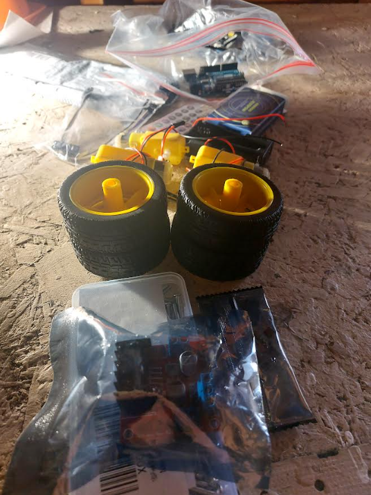
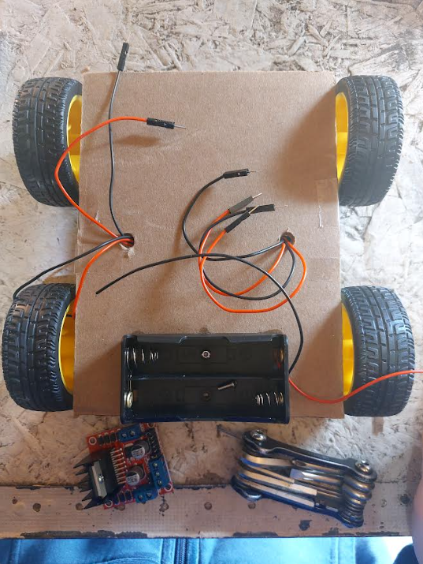
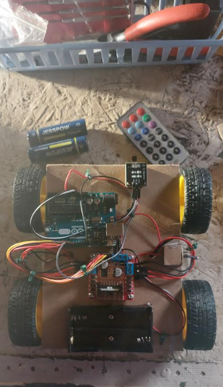

# Project Journal
## Total hardware time: 5 hours 13 minutes
#### Session 1 (3 hours 14 minutes)
Gathered all my materials and started at 10:40 in the morning :D  
  

I got hungry and ended the session at 1:54 for a lunch break. By then, Swoop looked like this:  

#### Session 2 (1 hour 59 minutes)
Adjusted the wires to be more organized, then ran off for dessert (have you ever heard of savarines? You really need to try them) at 4:14. The hardware part was all done!  
