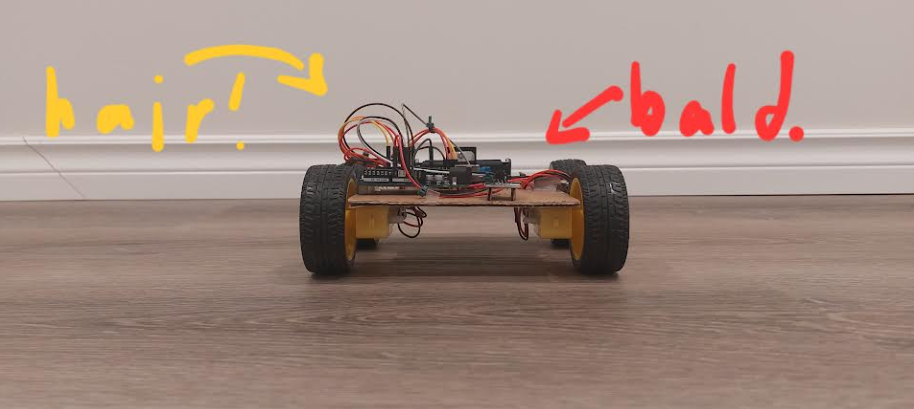

# arduinocar_athena
Say hi to Swoop, a car made of firsts, cardboard and tape (and some proper materials I promise-), and very importantly... hopes and dreams TT.  

Why is he named Swoop? Well, take a look.  

He styles his hair that way.  

## The what:
This lil guy is made of:
- Arduino UNO R3! Long story short, I talked to a tech-savvy passerby while I was hosting a bake sale, and by some miracle they decided to give the Arduino to me for free. Real thankful :D
- DC motors
- L298N Driver
- IR sensors
- Wires
He's my first project using my Arduino :D  

The static website to go along with it has tips and tricks I've learned along the way.

## The why:
I'm part of a robotics club, and when I asked the electrical lead how I could start learning wiring, she suggested a project using an Arduino. My 7-year-old brother goes crazy for cars, so I figured I'd make him an early birthday gift :D And to share what I've learned as well as refresh my front-end language knowledge, I built the website to go along with this hardware project.  

## The how:
Swoop was built, wired up and coded over the span of one day. (Yeah... I'll work on time management skills soon TT) Check out my Project Journal [JOURNAL](JOURNAL.md) for more info!

## What I've learned: