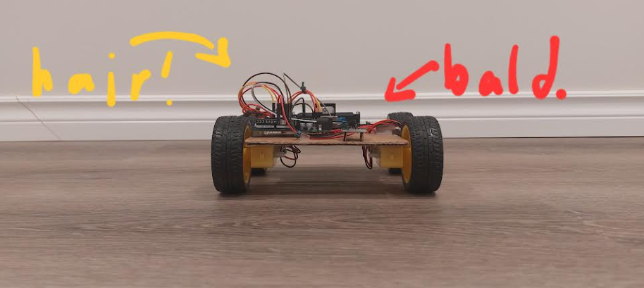

# arduinocar_athena
**Total project time:** _ hours and _ minutes  
  
Say hi to *Swoop*, a car made of firsts, cardboard and tape (and some proper materials I promise-), and very importantly... hopes and dreams TT.  

Why is he named Swoop? Well, take a look.  
  
He styles his hair that way.  

## The what:
This lil guy is made of:
- Arduino UNO R3! Long story short, I talked to a tech-savvy passerby while I was hosting a bake sale, and by some miracle they decided to give the Arduino to me for free. Real thankful :D
- DC motors
- L298N Driver
- IR sensors
- Wires  

He's my first project using my Arduino :D  

The static website to go along with it has tips and tricks I've learned along the way. INSERT WEBSITE LINK HERE

## The why:
I'm part of a robotics club, and when I asked the electrical lead how I could start learning wiring, she suggested a project using an Arduino. My 7-year-old brother goes crazy for cars, so I figured I'd make him an early birthday gift :D And to share what I've learned as well as refresh my front-end language knowledge, I built the website to go along with this hardware project.  

## The how:
Swoop was built, wired up and coded over the span of a weekend. (Yeah... I'll work on time management skills soon TT) Check out my [Project Journal](JOURNAL.md) for more info!

## What I've learned:
- How to solder wires, and repurpose the soldering iron to make other tasks easier :3 (melting off wires' protective cases)  
- How to use a multimeter to figure out a switch's settings or measure volts/ohms/amps  
- How to wire neatly
- C++'s void setup() and void loop() conventions as well as syntax like enum, switch, case, and digitalWrite() versus analogWrite()
- Understanding the L298 motor driver: IN1 to IN4 control motor direction. ENA and ENB control speed by allowing Pulse Width Modulation signals
- Understanding the Arduino: tildes beside pins means they can handle PWM
- Never blame bugs on low-quality hardware. It's like choosing the easy option out, giving up and blaming issues on something you can't control so it's not on your shoulders anymore. My neighbor immediately scolded me when I suggested my problems with the motors' speeds was a them issue XD and after hours of thinking and more of coding, it really did work out :D

## Made for Athena :D 
  

*Thanks for reading!* 🩷💛